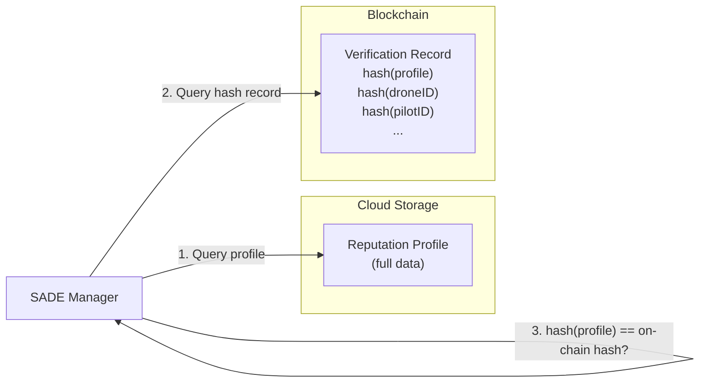

# Blockchain in SADE

FabricBackend is the Hyperledger Fabric blockchain backend for SADE. It provides a REST API that stores and retrieves drone-related records (certificates, reputation profiles, and general records) on an immutable ledger backed by CouchDB. Within SADE, it serves as the non-repudiable storage layer: every certificate issued by SafeCert, every reputation profile entry, and every audit trail update is committed as a blockchain transaction so that records cannot be silently altered or deleted.

---

## Record Model

Every item on the ledger shares a single `Record` structure:

| Field | Type | Description |
|-------|------|-------------|
| `recordID` | string | Unique identifier. Auto-generated if omitted on certificate/profile creation. |
| `droneID` | string | Drone identifier |
| `pilotID` | string | Pilot identifier |
| `zoneID` | string | SADE zone identifier |
| `recordType` | string | Discriminator: `"certificate"`, `"profile"`, or a custom type |
| `reserved` | string | Serialized JSON string carrying domain-specific payload (e.g., certificate fields, reputation data) |

The `reserved` field is intentionally opaque at the blockchain layer so that different SADE subsystems can store their own data structures without changing the chaincode.

---

## API Reference

Interactive OpenAPI documentation can be viewed through [link](https://proxy.web3db.org/nasa-project/docs#) when the server is running.

## Road Map: Cloud Data with On-Chain Verification

The current implementation stores full reputation records directly on the Hyperledger Fabric blockchain. In a later stage, the architecture will shift to a **cloud-primary, blockchain-verified** model that separates data storage from integrity verification.

### Planned Architecture

- **Cloud storage** holds the full reputation profile data (the complete set of fields described in the [reputation model](./reputation_modeling.md)).
- **Blockchain** stores a compact **verification record** containing:
  - A cryptographic hash of the full reputation profile.
  - Hashed versions of key identifiers (`droneID`, `pilotID`, `zoneID`, etc.) so that records remain queryable on-chain without exposing raw identifiers.

### Verification Flow

When the SADE Manager needs to evaluate a drone's reputation, it performs a two-source check:

1. **Query the cloud** for the full reputation profile.
2. **Query the blockchain** for the corresponding verification record (matched via the hashed identifiers).
3. **Recompute the hash** of the cloud-sourced profile and compare it to the hash stored on-chain. If the hashes match, the profile is confirmed to be unaltered; if they diverge, the data has been tampered with.

This design keeps the blockchain ledger lightweight while preserving non-repudiability: any modification to the cloud-stored profile will be detected during the hash comparison step. The hashed identifiers allow the SADE Manager to locate the correct verification record on-chain using standard Mango queries against CouchDB, without revealing the raw drone or pilot identifiers on the ledger.
